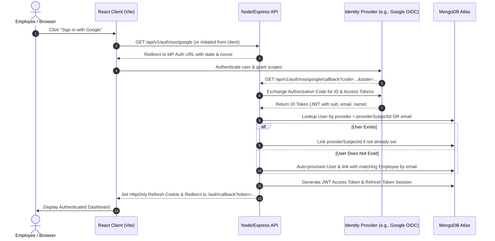

# MarichiHR HRMS — Enterprise Single Sign-On (SSO) & OpenID Connect (OIDC) Guide

This document details the Single Sign-On (SSO) and OpenID Connect (OIDC) architecture implemented in **MarichiHR HRMS Phase 1**.

---

## 1. Architecture Overview

MarichiHR provides enterprise SSO based on the OpenID Connect (OIDC) standard on top of OAuth 2.0. The authentication architecture supports:
- Multi-provider flexibility (Google Cloud Identity, Microsoft Entra ID / Azure AD, Okta, Keycloak).
- State-preserving OAuth 2.0 authorization flows with CSRF protection.
- Automated just-in-time (JIT) employee profile linking.
- Canonical callback routing pattern.

### The Canonical Callback Pattern

All SSO provider callbacks route through a single, consistent endpoint:

```http
GET /api/v1/auth/sso/:provider/callback
```

#### Supported Canonical Routes:
- **Google**: `GET /api/v1/auth/sso/google/callback`
- **Microsoft Entra ID**: `GET /api/v1/auth/sso/microsoft/callback`
- **Okta**: `GET /api/v1/auth/sso/okta/callback`
- **Keycloak**: `GET /api/v1/auth/sso/keycloak/callback`

---

## 2. Authentication Flow



---

## 3. Provider Configuration

### 3.1 Google Cloud Platform (GCP)

1. Navigate to [Google Cloud Console](https://console.cloud.google.com/).
2. Create or select a project (e.g., `marichi-hrms`).
3. Configure the **OAuth Consent Screen**:
   - **User Type**: Internal (for Google Workspace enterprise domains) or External (with test users).
   - **App name**: `MarichiHR HRMS`
   - **User support email**: `support@marichihrms.com`
   - **Scopes**: `openid`, `.../auth/userinfo.profile`, `.../auth/userinfo.email`
4. Create **OAuth 2.0 Client Credentials**:
   - **Application type**: Web application
   - **Name**: `MarichiHR Web Client`
   - **Authorized JavaScript origins**:
     - `http://localhost:5173` (local development)
     - `https://hrms.yourcompany.com` (production)
   - **Authorized redirect URIs**:
     - `http://localhost:5000/api/v1/auth/sso/google/callback` (local development)
     - `https://api.hrms.yourcompany.com/api/v1/auth/sso/google/callback` (production)
5. Copy the **Client ID** and **Client Secret** into your `server/.env`:
   ```ini
   SSO_ENABLED=true
   OIDC_ISSUER_URL=https://accounts.google.com
   OIDC_CLIENT_ID=1234567890-abcdef.apps.googleusercontent.com
   OIDC_CLIENT_SECRET=GOCSPX-xxxxxxxxxxxxxxxxxxxxxxxx
   OIDC_REDIRECT_URI_BASE=http://localhost:5000/api/v1/auth/sso
   OIDC_SCOPES=openid profile email
   ```

---

### 3.2 Microsoft Entra ID (formerly Azure AD)

1. Register an application in Azure Portal > **Microsoft Entra ID** > **App registrations**.
2. Set Redirect URI (Web): `https://api.yourdomain.com/api/v1/auth/sso/microsoft/callback`.
3. Configure API permissions: `OpenID permissions` (`openid`, `profile`, `email`).
4. Generate a Client Secret in **Certificates & secrets**.
5. Set environment variables:
   ```ini
   OIDC_ISSUER_URL=https://login.microsoftonline.com/{tenant-id}/v2.0
   OIDC_CLIENT_ID={client-id}
   OIDC_CLIENT_SECRET={client-secret}
   ```

---

### 3.3 Okta

1. In Okta Admin Console, go to **Applications** > **Create App Integration**.
2. Sign-in method: **OIDC - OpenID Connect**, Application type: **Web Application**.
3. Sign-in redirect URIs: `https://api.yourdomain.com/api/v1/auth/sso/okta/callback`.
4. Set environment variables:
   ```ini
   OIDC_ISSUER_URL=https://{yourOktaDomain}.okta.com/oauth2/default
   OIDC_CLIENT_ID={okta-client-id}
   OIDC_CLIENT_SECRET={okta-client-secret}
   ```

---

### 3.4 Keycloak

1. Create a realm (e.g., `marichi`).
2. Create client `marichi-hrms`, Client protocol `openid-connect`, Access type `confidential`.
3. Valid Redirect URIs: `http://localhost:5000/api/v1/auth/sso/keycloak/callback`.
4. Set environment variables:
   ```ini
   OIDC_ISSUER_URL=http://localhost:8080/realms/marichi
   OIDC_CLIENT_ID=marichi-hrms
   OIDC_CLIENT_SECRET={secret-from-credentials-tab}
   ```

---

## 4. Local Testing & Verification

1. Start both server and client:
   ```bash
   cd server && npm run dev
   cd client && npm run dev
   ```
2. Navigate to `http://localhost:5173/login`.
3. Click **"Sign in with Google"** (or configured SSO provider).
4. Authorize via your test Google account.
5. On redirection to `http://localhost:5000/api/v1/auth/sso/google/callback`:
   - The backend validates the authorization code and nonce.
   - Verifies the user's domain and tenant association.
   - Issues a JWT session and redirects to `http://localhost:5173/auth/callback?token=...`.
   - The frontend stores the access token in memory/state and loads the dashboard.

---

## 5. Common Troubleshooting Scenarios

| Issue | Cause | Resolution |
|---|---|---|
| `redirect_uri_mismatch` | Configured URI does not match GCP Console | Verify exact match down to port and path: `http://localhost:5000/api/v1/auth/sso/google/callback` |
| `Missing required employee profile` | User has authenticated but no HR employee record exists with that email | Pre-create the employee profile in HRMS or invite the employee first |
| `Cross-tenant authorization error` | SSO user belongs to a different organisation | Verify tenant email domain mappings in the Organisation configuration |
| `Token verification failed` | Clock skew or expired token | Ensure host system time is synchronized via NTP |
